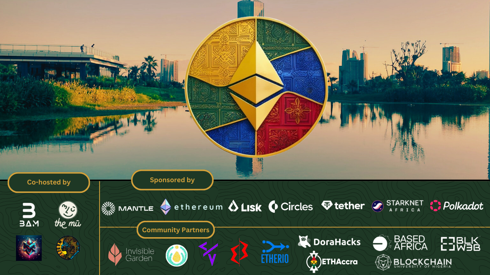

# **ETHiopia Pop-Up City: A Journey of Innovation & Community**

  
_Caption: Builders, mentors, and dreamers coming together to shape the future of Web3 in Africa._

## **💫 A Moment to Reflect**

What began as an ambitious idea turned into a living, breathing community of collaboration, where strangers became co-founders, where twitter friends became IRL frens, mentors became lifelong guides, and ideas once written in notebooks found their way into working smart contracts. ETHiopia was never just **_one_** event—it was an optimistic community of changemakers that looked for ways to connect with one another.

From the very first announcement, builders committed to traveling long distances to Addis Ababa... some even spending 24hours+ by road, because they recognized that this was something different. ETHiopia wasn’t just about learning how to build; it was about shaping the future of Web3 in a way that included Africa at the table, not as a guest but as a leader.

This report isn’t just numbers and metrics—it’s a love letter to everyone who believed in this vision and helped make it a reality.A testament to the brilliance, resilience, and untapped potential of African builders, thinkers, and dreamers.

## **📸 ETHiopia in Pictures**

_Because some moments can’t be captured in words._

|  |  |
| ------------------------------------ | ------------------------------------ |
|  |  |

## **📊 ETHiopia in Numbers: A Snapshot**

| **Category**                                                                        | **Number**                                                     |
| ----------------------------------------------------------------------------------- | -------------------------------------------------------------- |
| **African Countries Represented**                                                   | 8 🇪🇹🇨🇲🇹🇬🇬🇭🇳🇬🇰🇪🇺🇬🇪🇷 _+ our other frens from around the world_ 🫶 |
| **Builders in Residency**                                                           | 56 brilliant minds, living and co-working under one roof       |
| **Community Partners**                                                              | 9 special organizations that supported our vision              |
| **Sponsors**                                                                        | 11 who made this dream become reality                          |
| **Workshops, Solidity Sessions and Talks**                                          | 40+                                                            |
| **Demo Days**                                                                       | 3 (+ countless practice over 3 weeks)                          |
| **[Total Hackers](https://dorahacks.io/hackathon/ethiopiabamhackathon/buidl)**      | 105                                                            |
| **[Hackathon Projects](https://dorahacks.io/hackathon/ethiopiabamhackathon/buidl)** | 38                                                             |
|                                                                                     |

### **🚀 A Special Thank You**

ETHiopia would not have been possible without the support of our incredible partners. Special thanks to:

- Mark from Mantle
- Santiago from Lisk
- Carolina & Vanshika from Circles
- Vanessa & Griffin from the Ethereum Foundation
- Arnould from Tether
- KK from Starkware

Your belief in this vision made it a reality.

---

## **✨ What We Built Together**

### **🏗️ Builder Residency: From Ideas to Reality**

- **28 projects launched** – and let’s be honest, after Week 2, we had to encourage builders to focus on just one project. That was the hardest part—getting brilliant, agile minds to concentrate on the power of one thing. For a full list of projects, check out [ETHiopia's project directory](https://docs.google.com/spreadsheets/d/1PSoMYhmLxf1jsMVBcLrlTqCNQVgJKKtIc4jz6NFIYvM/edit?gid=0#gid=0).

A few standout projects:

- **Hakiba** –
- **Chapa Ride** – X
- **DAOBitat** – X

The beauty of ETHiopia wasn’t just in the final projects but in the late-night debugging sessions, the impromptu whiteboard discussions, and the collective resilience of builders who refused to settle for “good enough.”

ETHiopia proved that innovation doesn’t require glass skyscrapers or massive funding rounds—sometimes, it just takes a group of passionate people in a shared space, willing to be vulnerable with one another until they discover the one thing truly worth building.

### **🎤 Learning, Sharing, Growing**

- **Hands-on workshops** that left builders with tangible skills, not just theory.
- **Mentorship moments** that turned doubts into breakthroughs.

ETHiopia wasn’t just about learning how to use a new blockchain—**it was about learning how to think, question, and build with purpose.**

---

## **💬 What People Had to Say**

Instead of just words, the impact of ETHiopia is best captured in the reflections of those who experienced it firsthand.

> _“57 builders from 8 African countries, 21 days of hacking, over 100 builders participating in our hackathon, over 20 ideas built, and 2 startups incorporated.”_
>
> _“It was a life-changing experience! We built, learned, grew, and connected.”_
>
> Read more from [Duclair’s LinkedIn post](https://www.linkedin.com/posts/duclair-fopa_57-builders-from-8-african-countries-21-activity-7301616450379624448-9lsk?utm_source=share&utm_medium=member_desktop&rcm=ACoAACc1izQBMOS_J12rIGpCgHGp3wNxKUeXWxg).

ETHiopia’s impact resonated far beyond the event itself. We were honored to be highlighted in **Cointelegraph**, showcasing Ethiopia as a rising hub for blockchain innovation.

> “ETHiopia is the crypto event redefining the **humans** behind Africa’s web3 ecosystem.
>
> Read the full article here: [Cointelegraph: ETHiopia Pop-Up City](https://cointelegraph.com/events/events-page/ethiopia/)

These stories remind us why ETHiopia matters.

---

## **📢 The Bigger Picture: What Comes Next?**

ETHiopia was never meant to be a one-time event. The connections formed will last a lifetime, but here’s the more practical answer:

✅ **The African Onchain Collective (AOC) will continue to support builders in their founder journeys through mentorship and access to incubation programs.**  
✅ **Access to grant programs unlocked by Mantle.**  
✅ **Expanding our impact beyond this one event.**

### **Other Events on the Continent**

- [ETHSafari](https://ethsafari.xyz/)
- [ZuAfrique](https://x.com/zuafrique?s=11)
- [ETHEnugu](https://x.com/Eth_Enugu)
- [Web3 Lagos](https://x.com/Web3LagosCon)
- [ETHAccra](https://x.com/ETHAccra?ref_src=twsrc%5Egoogle%7Ctwcamp%5Eserp%7Ctwgr%5Eauthor)

We’re not done. Not even close.

---

## **🔗 Stay Connected**

🌍 **Website:** [ETHiopia.xyz](https://eth-iopia.xyz/)  
📲 **Twitter:** [@ETHiopia\_\_\_\_](https://x.com/ETHiopia____)

ETHiopia showed us that **Africa doesn’t need permission to innovate.** We’re already doing it.

The ETHiopia working team consisted of many exceptional leaders from across the ecosystem. Stay connected with the team! Mearaf from Xerxis, Diane & Simon from BAM, Pablo & Koko from the African Onchain Collective, Manon from the mu,

Liked any of the designs? Contact Wanjiku
Liked any of the photos? Contact Fidesio from HustleYangu

---

#### **Prepared by:**

The ETHiopia Team
